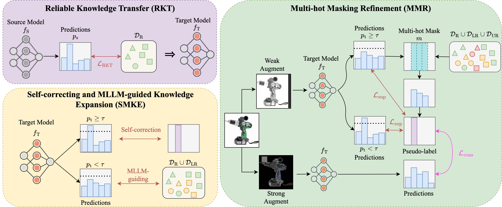

## [WACV 2026] Empowering Source-Free Domain Adaptation via MLLM-Guided Reliability-Based Curriculum Learning

[Dongjie Chen*](https://www.linkedin.com/in/dongjie-chen-94b21a165), 
[Kartik Patwari*](https://kartikp7.github.io/), 
[Zhengfeng Lai](https://zjujefflai.github.io/), 
[Xiaoguang Zhu](https://www.linkedin.com/in/xiaoguang-zhu-4b21bb26b/), 
[Sen-ching Cheung](https://sites.google.com/view/dr-cheung), 
[Chen-Nee Chuah](https://www.ece.ucdavis.edu/~chuah/rubinet/people/chuah/bio.html)


<div align="center">

[](https://github.com/Dong-Jie-Chen/RCL)
[](https://arxiv.org/abs/2405.18376)

<p align="center">
  
</p>

</div>

## Table of Contents


## Citation

If you find RCL is useful in your research or applications, please consider giving us a star 🌟 and citing our work.

```bibtex
@article{chen2024empowering,
  title={Empowering Source-Free Domain Adaptation via MLLM-Guided Reliability-Based Curriculum Learning},
  author={Chen, Dongjie and Patwari, Kartik and Lai, Zhengfeng and Zhu, Xiaoguang and Cheung, Sen-ching and Chuah, Chen-Nee},
  journal={arXiv preprint arXiv:2405.18376},
  year={2024}
}
```